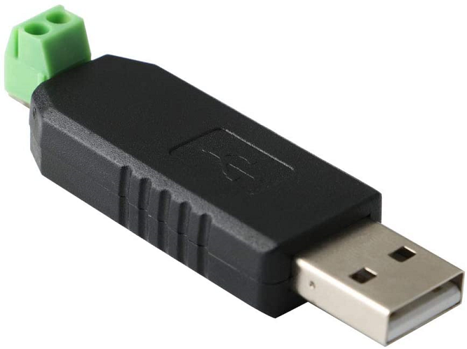
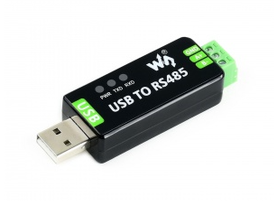
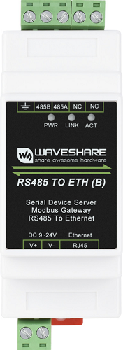
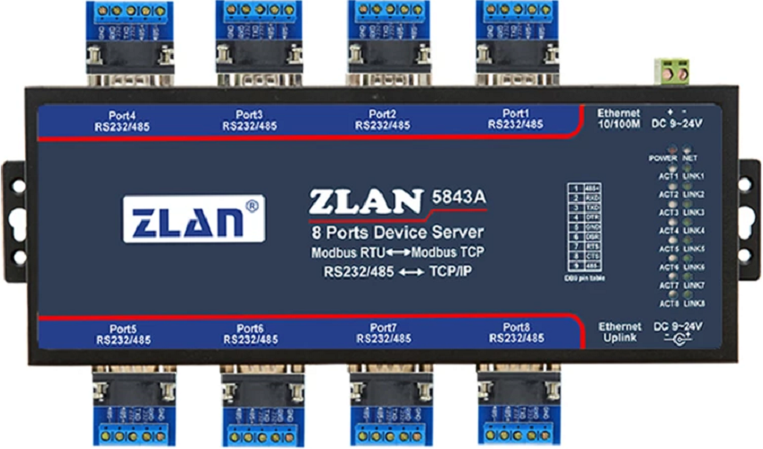
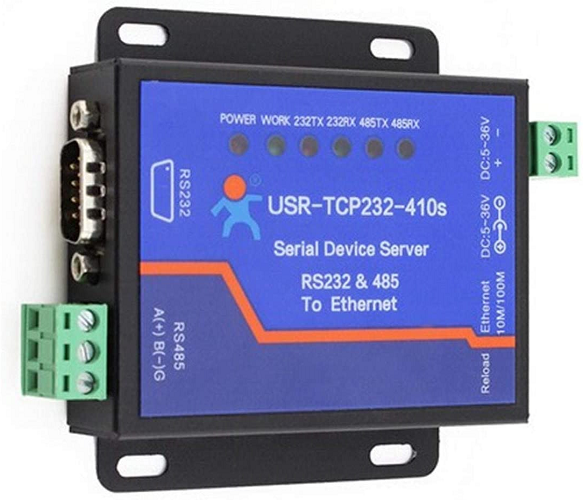
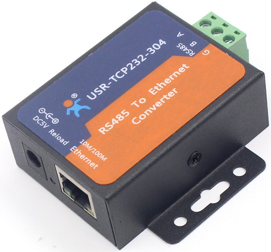

# Compatible RS485 Adaptors

This page does not use affiliate links, please only use these links as a guide. Shop around for the best prices!

## RS485 - USB

### Generic RS485 - USB

[Amazon UK Link1](https://www.amazon.co.uk/dp/B07K3V381Z),
[Berrybase Link1](https://www.berrybase.de/raspberry-pi/raspberry-pi-computer/usb-geraete/usb-rs485-konverter)

### Waveshare USB to RS485 FT232RL

Especially with tricky inverters like Sofar Solar the Waveshare USB to RS485 with FT232RL chipset provided the most reliable connection among other tested USB adapters:

Note that there are two versions with two different chipsets available. Make sure that you get the one with the FT232 RL chipset.

Also note that even this one does not work 100% reliably with the Sofar Solar HYD xxKTL. Recommended option for this inverter is to use the LSE-3 stick logger as described below.

## RS485 - Ethernet

Whatever adapter you buy, make sure it supports Modbus transmission. Transparent adapters that do not look into the Modbus protocol cannot send the packages to the correct Modbus slave.

### [USR-N510 RS232/RS485/RS422 to Ethernet](https://www.pusr.com/products/1-serial-port-etherne-device-servers-usr-n510.html)

Older version of the USR-N510 with DB9 connector supporting RS232/RS485/RS422

### [USR-W610 RS232/RS485 to Wifi & Ethernet](https://www.pusr.com/products/rs232/rs485-to-wifi-converters-usr-w610.html)

Only Ethernet mode tested so far.

[Amazon UK Link1](https://www.amazon.co.uk/dp/B07DNWM62H)

### [Waveshare RS485 to RJ45 Ethernet DIN Rail Mount - RS485 TO ETH (B) / RS485 TO POE ETH (B)](https://www.waveshare.com/wiki/RS485_TO_ETH_(B))

[Amazon UK Link1](https://www.amazon.co.uk/dp/B09MQTP16W) , [Amazon UK Link2](https://www.amazon.co.uk/dp/B09LQMH2S1) , [Amazon UK Link3](https://www.amazon.co.uk/dp/B09QMNWYLQ)

### [ZLAN5843A 8-port RS232/485 serial port to Ethernet](http://www.zlmcu.com/en/products_ZLAN5843A.htm)

[AliExpress](https://www.aliexpress.com/item/32888961582.html)

### For Sofar Solar: LAN Stick Logger LSE-3

Sofar Solar inverters are a big tricky with standard RS485 adapters. You may need to try several variants until you find one that is working flawlessly with the Sofar Solar inverter.

However there is one solution that works flawlessly and provides ModBus TCP out of the box: Replace the LSW-3 Wifi logger that comes with the inverter by the LSE-3 ethernet logger.

Configure the connection to its IP address on port 8899.

Tested with LSE-3 firmware version ME_0D_270A_1.09.

Note that port 8899 is also open on the LSW-3 logger, but any ModBus TCP connection attempts time out here.

### [SolaX PocketWiFi 3.0](https://www.solaxpower.com/monitoring-dongles/)

- Pocket WiFi 3.0 with Firmware V3.004.03 and above is only officially supported.
- SolaX only mentions Gen4 Hybrid, other inverters may work?

## Wifi - RS485

### [Tasmota modbus bridge on ESP8266](https://tasmota.github.io/docs/Modbus-Bridge)

An ESP8266 dongle with Tasmota installed and setup as a modbus bridge works great. 
Use a RS485 module to convert the modbus serial interface to RS485.
This works flawless for my Solis hybrid inverter.

## Untested but should work according to the specs...

### [USR-N510 RS485 to Ethernet](https://www.pusr.com/products/1-rs485-serial-port-etherne-device-servers-usr-n510.html)

Newer version of the USR-N510 without DB9 connector supporting RS485 (Specs mention RS232/RS485/RS422 Optional)

Should perform the same as the older version, although untested!

### [USR-TCP232-410S RS232 / RS485 Serial to Ethernet Adapter](https://www.pusr.com/products/modbus-serial-to-ethernet-converters-usr-tcp232-410s.html)

[Amazon UK Link 1](https://www.amazon.co.uk/dp/B07C1TC165)

## Might work but potentially more hassle...

### [USR-TCP232-304 only supports a Virtual Com Port?](https://www.pusr.com/products/1-port-rs485-to-ethernet-converters-usr-tcp232-304.html)

As this Model appears to only gives you a Virtual Com Port it might prove difficult to pass into Home Assistant running in a VM or Home Assistant OS?

- You can use Modbus RTU over TCP

[Amazon UK Link1](https://www.amazon.co.uk/dp/B07BC77L8K)

## Non Working / Troublesome RS485 Adaptors

### [SolaX PocketLAN](https://www.solaxpower.com/monitoring-dongles/)

This adaptor does not provide a Modbus connection

### [SolaX PocketWiFI 2](https://www.solaxpower.com/monitoring-dongles/)

- This adaptor provides a very unreliable Modbus connection, if any connectivity at all.
- No support for this adaptor will be provided.

### [Waveshare RS485 to WIFI/ETH](https://www.waveshare.com/wiki/RS485_TO_WIFI/ETH)

This RS485 adaptor is very problematic:
- There seems to be delayed communications,
- Struggles to read more than 7 registers at a time,
- Modbus Error: [Input/Output] Unable to decode request,
- No ability to set "Auto query storage type" for Sofar Inverters.

### [Waveshare RS485 to ETH](https://www.waveshare.com/wiki/RS485_TO_ETH)
**Not to be confused with the DIN Rail mounted Waveshare RS485 TO ETH (B) mentioned above.**
- This adaptor does not support "Modbus Transmission" it is a passive device.
- You can't submit requests to the Inverter.
- It does not work!
