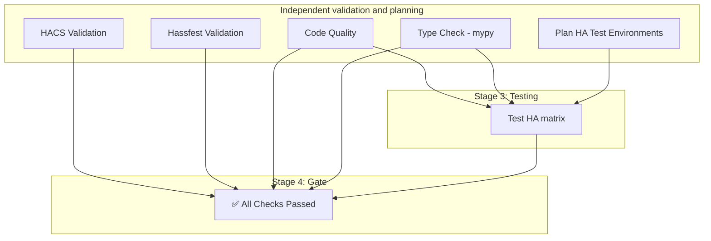

# CI and testing

This page describes the GitHub Actions workflow, job dependencies and test execution.
For setup, local commands and test environment configuration, see [Contributing](../contributing.md).

## Pipeline Architecture

The pipeline is defined in `.github/workflows/ci-cd.yml`. Quality, static validation and matrix planning run independently.
Tests wait for quality, type checking and the matrix plan. All selected HA environments finish independently (`fail-fast: false`).

## Stages and Jobs

### 1. Code Quality (`quality`)
Runs `pre-commit` checks including:
*   **Ruff**: Linting and formatting.
*   **Codespell**: Spelling checks.

Strict mypy runs in the parallel Type Check job, so pre-commit skips that hook in CI.
Both jobs use the quality environment pinned by `uv.lock`. The baseline freshness check is advisory.
uv dependency caching is explicitly enabled; these jobs share the locked quality cache.
Only Code Quality saves that cache; Type Check restores it without competing uploads.

### 2. Static Analysis
*   **Type Check (`mypy`)**: Runs strict mode type checking on the component and tests.
*   **HACS Validation (`hacs`)**: Ensures the repository structure meets HACS requirements.
*   **Hassfest Validation (`hassfest`)**: Validates the integration against Home Assistant core standards.

All jobs in this pipeline inherit `contents: read` permissions. HACS repository validation does not require write access;
results appear in the job's checks and logs. No PR-comment step is configured.
The workflow omits the legacy `comment` input: it remains declared in the
[action metadata](https://github.com/hacs/action/blob/main/action.yml), but the
[current implementation](https://github.com/hacs/integration/blob/main/action/action.py) does not use it.
This matches the [official HACS validation example](https://www.hacs.xyz/docs/publish/action/), which needs no write permissions.

### 3. Testing
`scripts/plan_ha_tests.py` selects profiles from `.github/ha-test-environments.json`
and the test suite for each event. All profiles use the same `test-ha` job steps
for dependency resolution, version verification, pytest and artifacts:

*   **Branch pushes other than `main`**: Run non-slow tests for profiles with `branch_push: true` (current stable HA by default).
*   **PRs, `main` updates, manual runs and the daily schedule**: Run the full suite for all configured profiles (minimum/current by default).

Only runtime and test requirements are included; dev tools remain in the locked quality environment.
The uv cache is keyed by the generated requirements, environment name and selected Python; `--upgrade` still resolves dependencies afresh.
The daily schedule detects new stable HA releases automatically. For HA/Python selection
and adding profiles, see [test environment configuration](../contributing.md#home-assistant-compatibility).

GitHub CI has no separate locked-baseline pytest job. There are currently no tests
marked `slow`, so quick/full select the same cases; the distinction remains available
for future slow tests.

### 4. Final Gate (`all-checks-passed`)
This job acts as the single source of truth for the pipeline status. It will only succeed if:
1.  Code Quality and Type Check pass.
2.  HACS and Hassfest validations pass.
3.  Every selected HA test environment passes.

Failed, cancelled or skipped required jobs fail the gate.

## Local checks and GitHub CI

Local `make ci` uses the locked baseline; GitHub runs pytest in dynamically selected
HA environments and adds HACS/hassfest validation. A successful local run therefore
does not guarantee the complete online workflow.

Local commands, including the full dynamic matrix, are documented in
[Contributing](../contributing.md#before-committing-opening-a-pr).
