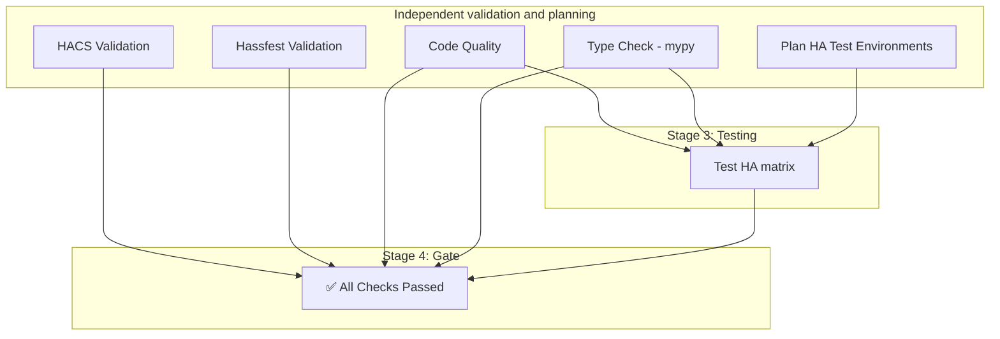

# CI/CD Pipeline

The `solax_modbus_repo` uses a unified GitHub Actions pipeline to ensure code quality, type safety, and functional correctness.

## Pipeline Architecture

The pipeline is defined in `.github/workflows/ci-cd.yml`. Quality, static validation and matrix planning run independently.
Tests wait for quality, type checking and the matrix plan. All selected HA environments finish independently (`fail-fast: false`).


```mermaid
graph TD
    subgraph Independent validation and planning
    Q[Code Quality]
    M[Type Check - mypy]
    H1[HACS Validation]
    H2[Hassfest Validation]
    P[Plan HA Test Environments]
    end

    subgraph Stage 3: Testing
    Q --> TH[Test HA matrix]
    M --> TH
    P --> TH
    end

    subgraph Stage 4: Gate
    H1 --> ALL[✅ All Checks Passed]
    H2 --> ALL
    Q --> ALL
    M --> ALL
    TH --> ALL
    end
```

## Stages and Jobs

### 1. Code Quality (`quality`)
Runs `pre-commit` checks including:
*   **Ruff**: Linting and formatting.
*   **Codespell**: Spelling checks.

Strict mypy runs in the parallel Type Check job, so pre-commit skips that hook in CI.
Both jobs use the quality environment pinned by `uv.lock`. The baseline freshness check is advisory.
uv dependency caching is explicitly enabled; these jobs share the locked quality cache.
Only Code Quality saves that cache; Type Check restores it without competing uploads.

### 2. Static Analysis
*   **Type Check (`mypy`)**: Runs strict mode type checking on the component and tests.
*   **HACS Validation (`hacs`)**: Ensures the repository structure meets HACS requirements.
*   **Hassfest Validation (`hassfest`)**: Validates the integration against Home Assistant core standards.

All jobs inherit `contents: read` permissions. HACS runs validation without automatic PR comments, so no job needs write access.

### 3. Testing
The shared `test-ha` matrix is configured in `.github/ha-test-environments.json`:

*   **Branch pushes**: Run non-slow tests once against current stable HA.
*   **PRs, main branch updates, manual and scheduled runs**: Run the full suite against minimum and current stable HA.

Minimum HA comes from `hacs.json.homeassistant`; current HA comes from the latest stable Core release.
Each environment selects Python from that HA tag's metadata and resolves a matching test plugin.
Only runtime and test requirements are included; dev tools remain in the locked quality environment.
The uv cache is keyed by the generated requirements, environment name and selected Python; `--upgrade` still resolves dependencies afresh.
GitHub CI has no separate locked-baseline pytest job. Additional HA versions can be added to the same matrix.

### 4. Final Gate (`all-checks-passed`)
This job acts as the single source of truth for the pipeline status. It will only succeed if:
1.  Code Quality and Type Check pass.
2.  HACS and Hassfest validations pass.
3.  Every selected HA test environment passes.

Failed, cancelled or skipped required jobs fail the gate.

## Local Development

Before pushing changes, run the standard local checks:

```bash
make ci
```

This runs locked quality checks and local locked-baseline quick tests. For the full dynamic HA matrix plus quality checks,
run `make ci-full`; HACS/hassfest validation runs separately on GitHub. See [CONTRIBUTING.md](../../CONTRIBUTING.md)
for individual commands and environment records.
