# CI/CD Pipeline

The `solax_modbus_repo` uses a unified GitHub Actions pipeline to ensure code quality, type safety, and functional correctness.

## Pipeline Architecture

The pipeline is defined in `.github/workflows/ci-cd.yml` and follows a **Fail-Fast** strategy across four stages.

```mermaid
graph TD
    subgraph Stage 1: Quality
    Q[Code Quality]
    end

    subgraph Stage 2: Static Analysis
    Q --> M[Type Check - mypy]
    Q --> H1[HACS Validation]
    Q --> H2[Hassfest Validation]
    end

    subgraph Stage 3: Testing
    M --> TQ[Test Quick]
    M --> TC[Test Comprehensive]
    end

    subgraph Stage 4: Gate
    H1 --> ALL[✅ All Checks Passed]
    H2 --> ALL
    TQ --> ALL
    TC --> ALL
    end
```



## Stages and Jobs

### 1. Code Quality (`quality`)
Runs `pre-commit` checks including:
*   **Ruff**: Linting and formatting.
*   **Codespell**: Spelling checks.
*   **Yamllint**: YAML syntax validation.
*   **Gitleaks**: Secret detection.

### 2. Static Analysis
*   **Type Check (`mypy`)**: Runs strict mode type checking on the component and tests.
*   **HACS Validation (`hacs`)**: Ensures the repository structure meets HACS requirements.
*   **Hassfest Validation (`hassfest`)**: Validates the integration against Home Assistant core standards.

### 3. Testing
*   **Test Quick**: Runs non-slow tests on Python 3.12 for every push to feature branches.
*   **Test Comprehensive**: Runs the full test suite on Python 3.12 and 3.13 for PRs, main branch updates, and scheduled runs.

### 4. Final Gate (`all-checks-passed`)
This job acts as the single source of truth for the pipeline status. It will only succeed if:
1.  HACS and Hassfest validations pass.
2.  The relevant test suite (Quick or Comprehensive) passes.

## Local Development

Before pushing changes, you can run most of these checks locally using `uv`:

```bash
# Run linting/formatting
uv run pre-commit run --all-files

# Run type checking
uv run mypy custom_components/solax_modbus tests --strict

# Run tests
uv run pytest
```
