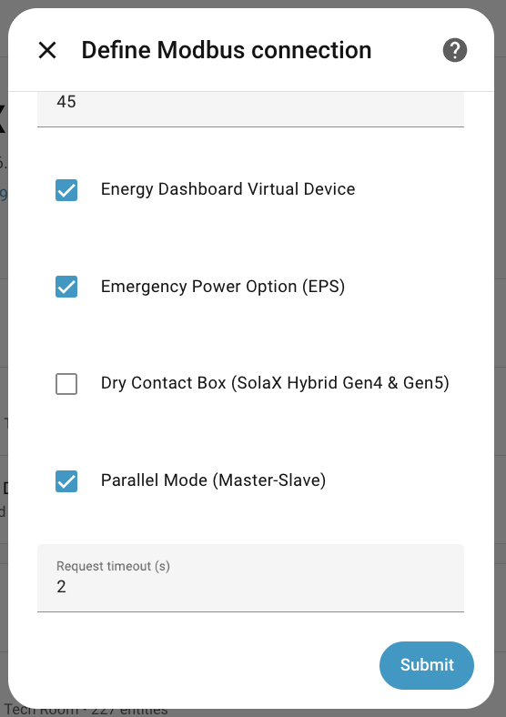
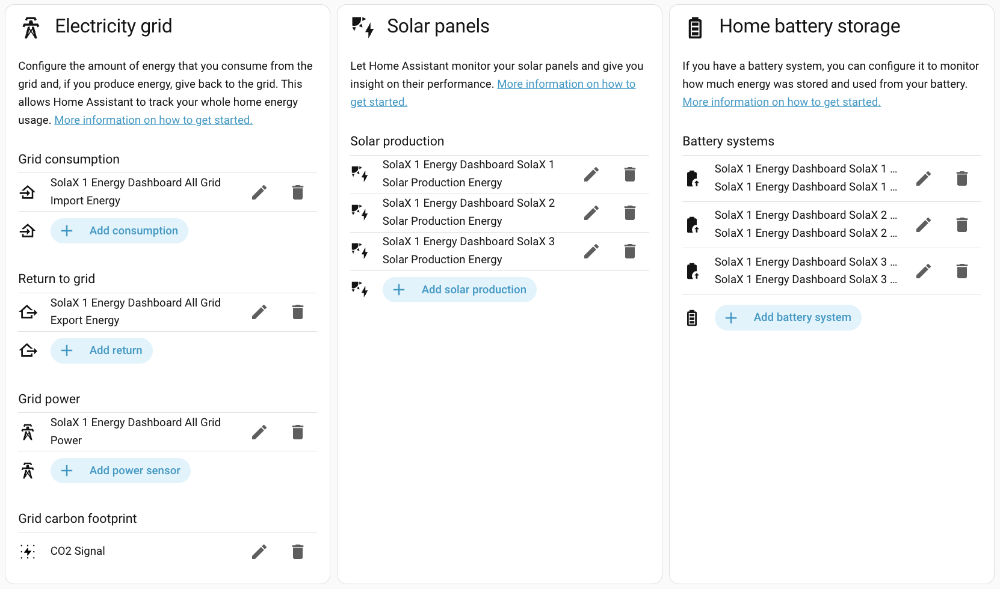

# Energy Dashboard Setup

## Overview

This guide explains how to enable the virtual Energy Dashboard device and connect the curated sensors to Home Assistant’s Energy Dashboard.

## Prerequisites

- SolaX Modbus integration installed and working
- Inverter reachable and providing live data
- (Optional) Parallel mode configured if you have multiple inverters

## Enable Energy Dashboard

1. Open **Settings → Devices & Services**
2. Select the **SolaX Modbus** integration
3. Open the integration **Options**
4. Enable **Energy Dashboard device**
5. Save changes and reload the integration

## Configure Home Assistant Energy Dashboard

1. Open **Settings → Dashboards → Energy**
2. Add your grid, battery, and solar energy sensors
3. Select the **Energy Dashboard** sensors created by the integration

## Parallel Mode Notes

- The Primary inverter exposes “All” sensors (system totals)
- Per‑inverter sensors are also available for individual visibility
- If you are in parallel mode, make sure the Primary inverter is connected

For parallel mode setup guidance, see: `solax-parallel-mode.md`.

## Diagnostics

The Energy Dashboard device includes diagnostics to explain:
- Standalone vs parallel mode
- Inverter count
- Debug override (if enabled)

Diagnostics help validate your setup if data looks unexpected.

## Troubleshooting

- If sensors are missing, reload the integration
- Check the device’s Diagnostics section for mode and count
- Confirm you enabled the Energy Dashboard device in options

