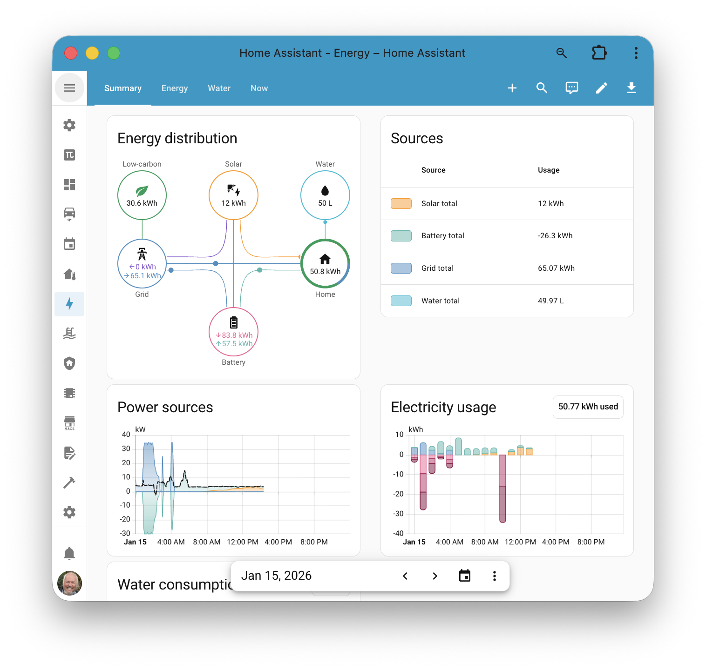
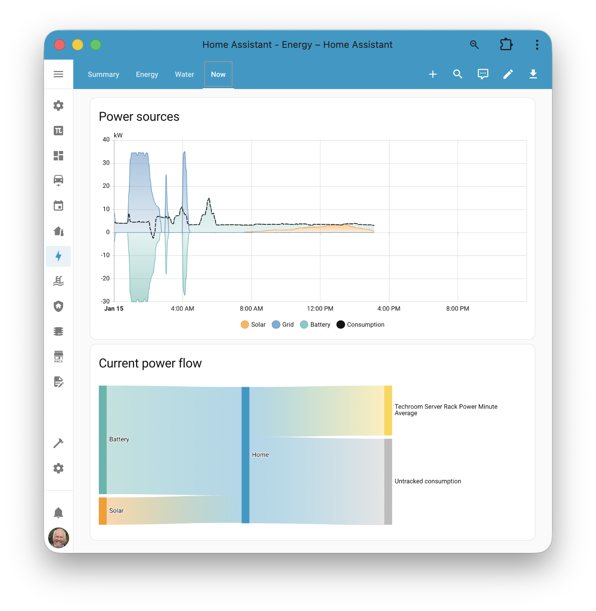
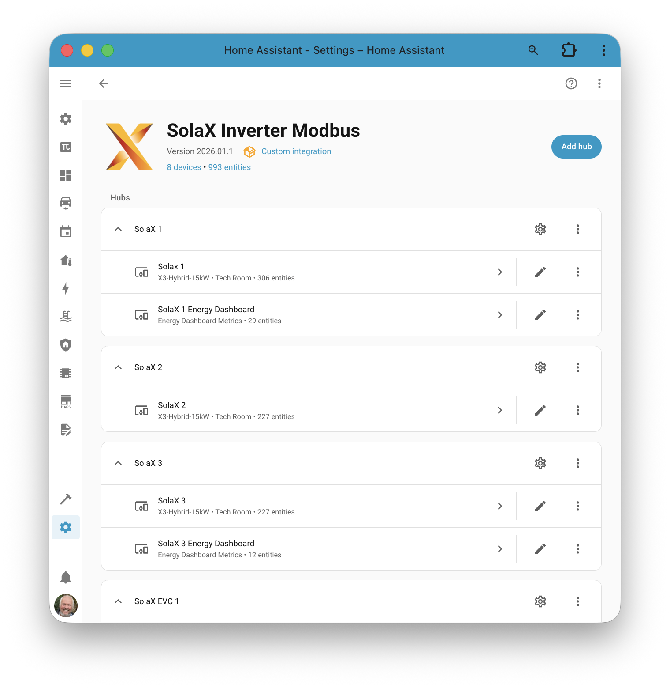
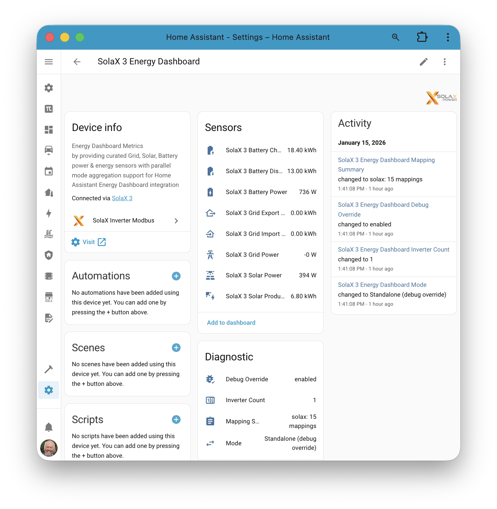
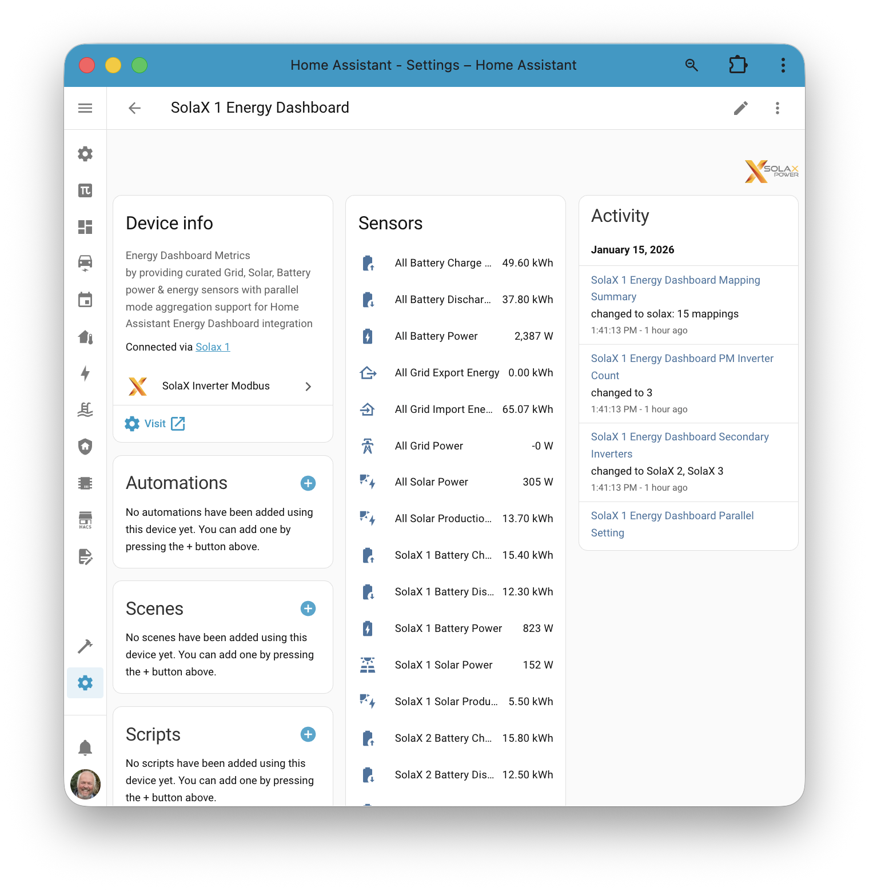

# SolaX Energy Dashboard

## Overview

The Energy Dashboard feature provides a dedicated virtual Energy Dashboard device with curated grid, battery, and solar sensors designed to match Home Assistant Energy Dashboard requirements.

Key outcomes:
- Consistent sensor naming and sign conventions
- A unified Energy Dashboard device with diagnostics
- Parallel mode support (Primary + Secondary inverters)

**Note:** The Home Assistant Energy Dashboard itself updates with a delay (typically around an hour).

## Energy Dashboard (Historic)

The main Energy Dashboard focuses on energy sensors and requires clean, correctly signed energy entities.

## Energy Dashboard Now (Realtime)

The "Now" view focuses on power sensors and requires correct real‑time power entities. This used to be a major pain point, but the Energy Dashboard virtual device provides both energy and power sensors with consistent conventions.

## Sensors and Adaptation

SolaX inverters expose many raw sensors that can feed the Home Assistant Energy Dashboard, but they typically need:
- Naming and category alignment (grid, battery, solar)
- Sign convention adjustments (import/export, charge/discharge)
- Aggregation for parallel systems

Historically this required custom helper entities and extra calculations. The Energy Dashboard implementation now provides ready‑made mappings that adapt inverter data to the exact requirements of the Home Assistant Energy Dashboard.

## Why This Matters

With the virtual Energy Dashboard device enabled:
- Advanced sensors are created automatically
- Parallel mode systems are handled consistently
- Setup in the Home Assistant Energy Dashboard becomes straightforward

## What the Integration Adds

When Energy Dashboard is enabled, the integration creates:
- A **virtual Energy Dashboard device** per inverter hub
- Grid, battery, and solar **power** sensors
- Grid, battery, and solar **energy** sensors
- Diagnostics to explain mode and configuration

Standalone and parallel examples:

Standalone view shows the curated, correctly signed sensors for a single inverter.

Parallel view includes **All** metrics (system‑wide totals across the parallel system) plus per‑inverter measurements for detailed solar and battery tracking.

## Parallel Mode Support

Parallel systems are supported with a Primary inverter and one or more Secondary inverters. The virtual Energy Dashboard device:
- Uses Primary totals for "All" sensors where available
- Exposes per‑inverter sensors to show individual contributions

For full parallel‑mode setup guidance, see: [solax-parallel-mode.md](solax-parallel-mode.md).

## Next Steps

For setup steps and config flow details, see: [energy-dashboard-setup.md](energy-dashboard-setup.md).
