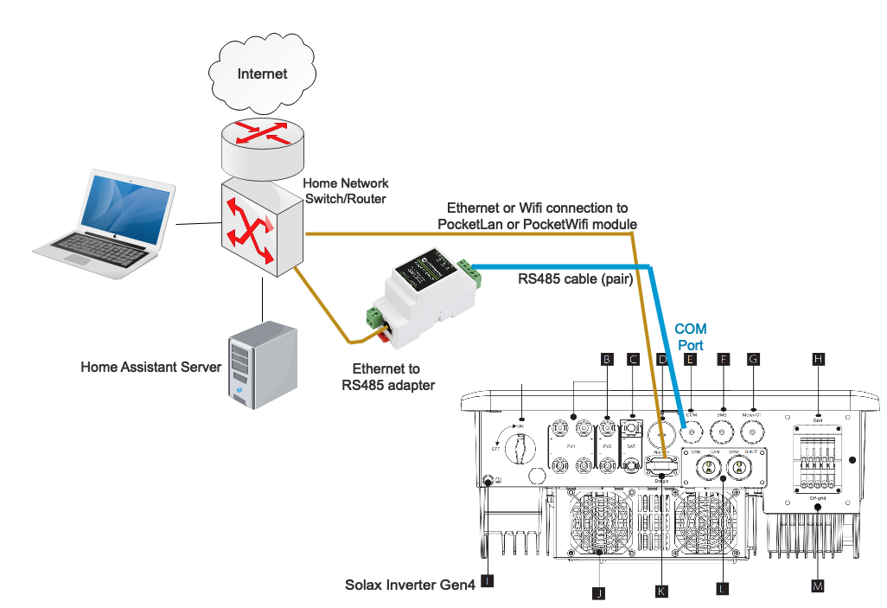
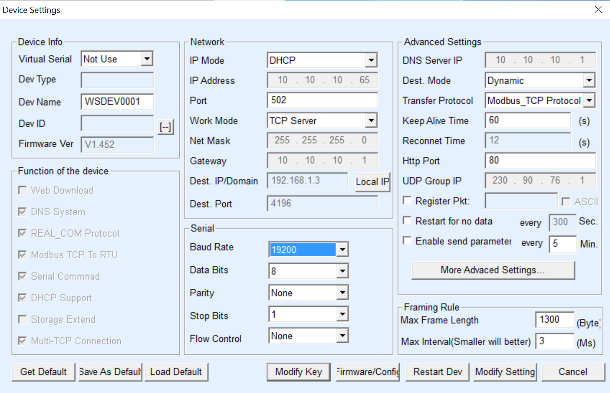
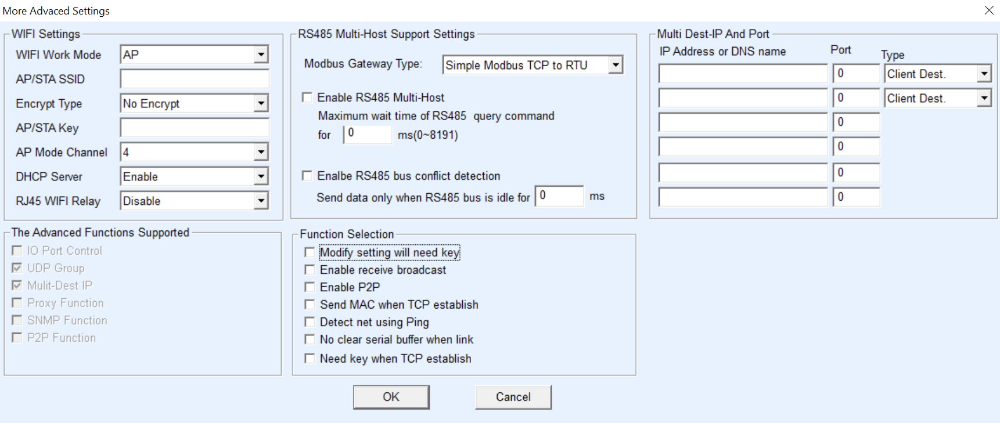
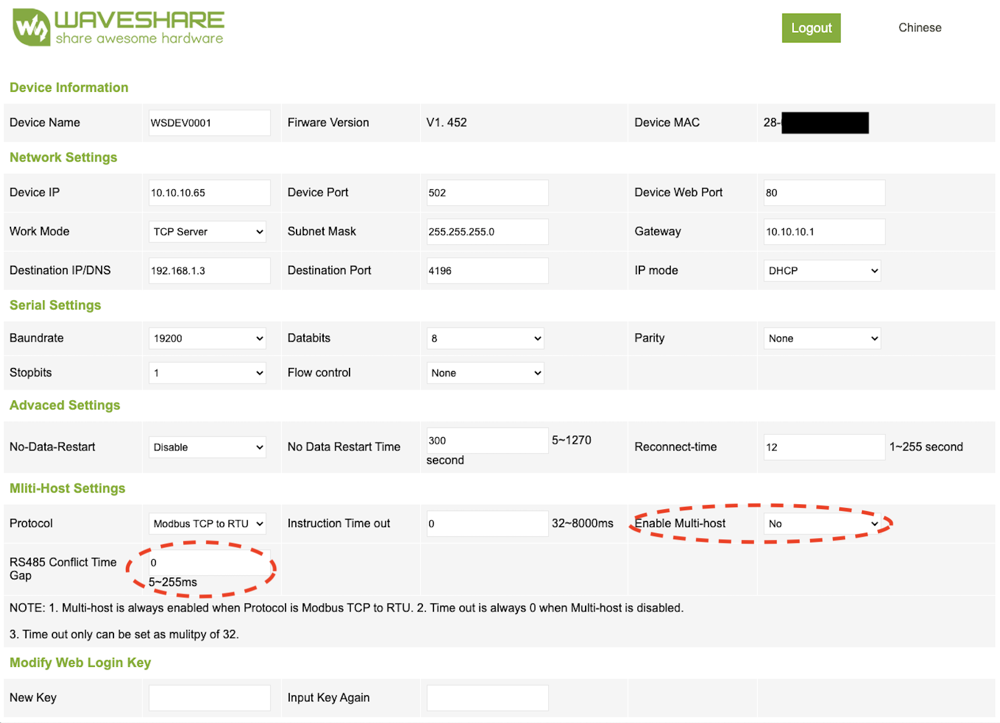
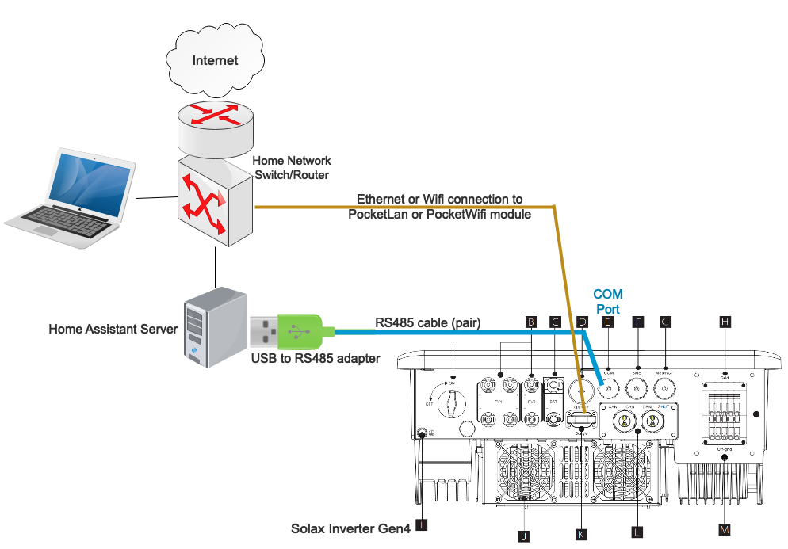

# Modbus adapter setup

**This guide is aimed at SolaX but gives an idea for other Inverters, there is some other Inverter Specific details listed**

## Connection methods

  - SolaX G2 & SolaX G3 Hybrids have built in Ethernet (The Qcells Q.VOLT HYB-G3-3P is a SolaX G4 despite the G3 naming).
  - SolaX G4 and other don't have built-in Ethernet, communication is possible via serial RS485 COM port.
    - SolaX only - Not all SolaX dongles provide modbus communication, the minimum supported PocketWiFi is [PocketWiFi 3.0](#solax-pocketwifi-30) PocketLAN does not provide a Modbus connection.
    - [RS485 to Ethernet adapter](#waveshare-rs485-to-eth-b) - the best way to connect to your inverter.
    - [RS485 to USB adapter](#usb-to-rs485-adaptor) - not recommended, can cause errors in HA.
    - Solis dongle - see below

The RS485 interface uses only the pin4 (blue wire) and pin5 (white-blue). Polarity matters, so make sure pin4 (blue wire in typical cables) is connected to the A lead of your adapter and pin5 (white-blue wire) to the B lead of your adapter.

RS485 cables can be fairly long, so 25 meter or more is possible. You can use the blue pair of a standard cat5 or cat6 cable.

Make sure you verify your inverter's baud rate with the [Wiki Page](baudrates.md) and make sure it matches the baud rate of the Ethernet to RS485 adapter
You can confirm the baud rate on the LCD screen on the front of your Inverter, within the Menu's.

The Modbus address be default is 1. Some people have reported that their Modbus address was 4.

Attention: This work is based on the common protocol documentation for the X1 and X3 devices. The documentation is not always clear which parameters do not apply to the X1 inverter, so some of the entities that appear may not have a meaning on X1. You can report this and they can be removed for X1.

```{note}
There is a port marked COM on the G4 inverter, some user manuals by mistake claim that this is an Ethernet port.

DO NOT CONNECT THIS COM PORT TO AN ETHERNET SWITCH - your Ethernet switch port will die if you do!!!
```

## Waveshare RS485 to ETH (B)



- connects through Ethernet to your home network router/switch
- use the "vircom" tool (Windows) to set the IP address matching your lan (or to let the device use DHCP, it does not use DHCP by default, however we recommend using a static IP)
- configure it to use "Modbus TCP to RTU", make sure the work mode is "TCP Server" and the server listens to port 502. Make sure the baudrate matches the baudrate of your inverter (see:  settings > advanced settings > modbus > baud rate)


- In "More Advanced Settings...",
    - **SolaX** set Modbus Gateway Type to "Simple Modbus to TCP/IP mode"
    - **Sofar Solar & possibly Growatt** set Modbus Gateway Type to "Auto query storage type"
    - all other parameters can be left default


- you can verify the config by opening the webpage of your adapter: http://<waveshare_ip_addr>. It should show something like:

- In the unlikely case you have multiple inverters connected to one RS485 adapter, you may need to modify the multi-host flag (untested). The system will increase the gap between messages, which will slow down the communication throughput. Make sure your polling interval is long enough (the act led should not light up all the time).
- if all is well, the PWR LED should be red, the LINK LED should initially be green and become permanently blue as soon as HA has made the connection. The ACT LED should be off most of the time but should flash green (send) and blue (receive) briefly every 15 seconds (the default polling interval). From the Waveshare documentation:
    - If the Link light is not green, the network cable is not connected properly, please check the network cable. 
    - If the Link light is not blue (only consider the TCP working mode), the host computer software does not have a serial port The server establishes a connection, please consider whether the IP address is configured in the same network segment. 
    - If the Active light is green, it means that the network port is sending data, but there is no serial device returning data. Please check whether the baud rate is configured properly and whether the RS485 positive and negative are connected reversely

When configuring the SolaX Modbus integration, specify the network IP address of the Waveshare device, not the address of the SolaX.
Do not tick the Serial RS485 flag; the serial port is ignored in this setup.

## USB to RS485 adaptor



- Directly USB-connected to your HA system
- This low cost model can be found in various e-shops, search for USB RS485
- Chipset CH340C (similar products with FTDI FT232 chipset should also work but are more expensive)

When configuring the SolaX Modbus Integration, tick the 'RS485 serial port' flag, and specify the actual serial port name  (as seen in the output of 'ls /dev/ttyUSB*'). In case you have more than one usb device, it makes sense to use the name seen in the output of 'ls /dev/serial/by-id'. In this setup, the IP address and TCP port do not matter, use 'localhost' as IP address and leave the TCP port default 502.

## Multiple inverters connected to one RS485 adaptor & Terminating resistors

It should be possible to connect multiple inverters to the same RS485 adapter (eg Waveshare). The inverters must have different Modbus addresses, so you need to change the Modbus addresses of the inverters first. Then configure one instance for each inverter. The configuration dialogue allows you to set the Modbus address.

The use of Terminating resistors is required when connecting multiple Inverters. Place a 120Ohm resistor accross A&B at the RS485 adaptor and place a 120Ohm resistor accross A&B on the last connected Inverter.

## SolaX PocketWiFi 3.0

This interface requires more testing and is not guaranteed to work:

- [Connect the dongle to your Wi-Fi network](solax-faq.md#how-to-connect-pocketwifi-30-to-my-wi-fi-network)
- [Update the firmware to the latest version](solax-firmware-update.md#pocketwifi-30)
- Setup integration with IP of the dongle and other settings default.

## Solis Inverters

Those with a socket for a datalogger - e.g., Hybrid models.

The integration could rely on the Modbus TCP supported by some Solis dataloggers. However, there are certain challenges and proposed solutions:
- `DLS-L` - **compatible** - an obsolete datalogger - hard to get, and no longer supported by Solis. There are newer and older models with different support levels. If you have a newer one with a serial number starting `1920xxxxxx`, you are lucky in some way. **The older ones are likely not to work.**
- `S2-WL-ST` - **compatible** - it will stop reporting to Solis Cloud **(*)** once you configure the integration and start polling data to Home Assistant (and that means any other integration too).
- `DLS-W` - **not compatible** - an obsolete datalogger - you should search for SolarMan-based integrations.
- `S3-WIFI-ST` - **not compatible** - a newer model - works with the Solis Cloud only.
- You could connect your inverter using any of the [Compatible RS485 Adaptors](https://github.com/wills106/homeassistant-solax-modbus/wiki/Compatible-RS485-Adaptors) when combined with the female plug `Exceedconn EC04681-2023-BF` - as there is no datalogger, there will be no Solis Cloud **(*)** reporting.
- A combined method of Solis Cloud and Home Assistant using [any Datalogger](https://github.com/alienatedsec/solis-ha-modbus-cloud#supported-solis-dataloggers) as well as wiring, and how to connect and configure Waveshare devices to work with this integration are described in detail at [https://github.com/alienatedsec/solis-ha-modbus-cloud](https://github.com/alienatedsec/solis-ha-modbus-cloud)

**(*) Disconnecting Solis Cloud is to prevent Solis engineers and your installer to support and monitor your PV installation.**

The comparison of functions and dependencies:
