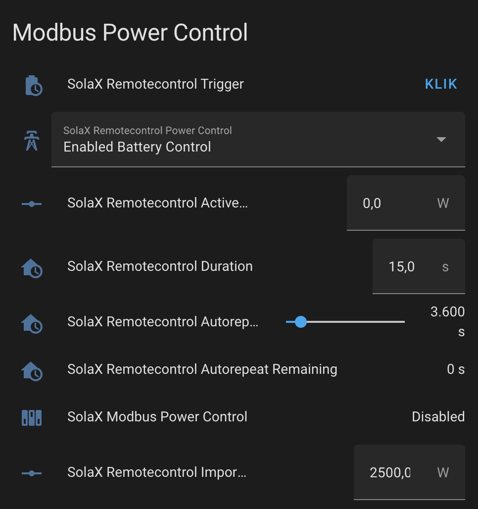
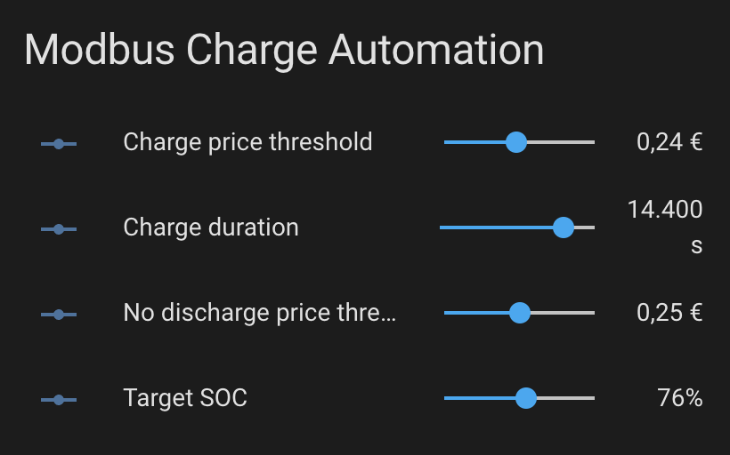

# Modbus Power Control (remotecontrol power)

## Why use Modbus power control?

Normal power controls are written to EEPROM, so there are not well suited for use in automations as the automation might write too often. 
The Modbus power control commands (remotecontrol_xxx) are not stored in EEPROM and can be called as often as desired. The lifetime of these commands is however limited, so they need to be repeated frequently. Fortunately, this integration has an autorepeat option that makes these commands as easy to use as the normal power control parameters.

To make it even more easier to use, an emulation of the self_use and feedin_priority modes is offered (next to the grid_control, battery_control option or active_power_control).

Currently, this section only applies to Solax GEN4 hybrid inverters. A section for GEN3 might be added later.
This feature makes it possible to control the 'activepower' directly.

As we are still experimenting to find the proper controls that can be easily used by automations, the interfaces described below may still change. This may break automations based on these parameters.


## Solax Gen4 approach

The Solax Gen4 inverters use a modbus write_multiple_registers command.
On the Gen4, these actions are not stored in EEPROM, so they can be executed frequently.
The integration hides this complexity and implements one button to trigger a single or repeated update(s). The action behind this button is configurable through 6 parameter entities.

_Please note that the controls described in this section cannot throttle/limit the PV power. If needed, the `export_control_user_limit` entity can be modified in cases where the export needs to be limited by also limiting PV power. Unlike other entities described in this section, `export_control_user_limit` is written to EEPROM, so the amount of changes to this entity needs to be limited._

With these parameters a power control dashboard card can be created:



### Main trigger button
* `remotecontrol_trigger` : 
   button that triggers a new remotecontrol timeslot on the inverter. The behavior during this time slot is determined by a set of non-persistent parameter registers:

### Parameter entities

* `remotecontrol_power_control`: either 
  * `"Disabled"`, 
  * `"Enabled Power Control"`,
  * `"Enabled Grid Control"`,
  * `"Enabled Battery Control"`,
  * `"Enabled Self Use"`,
  * `"Enabled Feedin Priority"`
  * `"Enabled No Discharge"`

Solax values `"Enabled Quantity Control"` and `"Enabled SOC Target Control"` are not implemented. 

`"Enabled Grid Control"`, `"Enabled Battery Control"`, `"Enabled Self Use"` and `"Enabled Feedin Priority"` are target values computed by the integration. 

* `remotecontrol_set_type`: Either `"Set"` or `"Update"`. Only "Set" has been tested and seems to work for updates also.
* `remotecontrol_active_power`: The **target** active power level. The current implementation will automatically limit the specified value into the range determined by the modbus registers `active_power_lower` and `active_power_upper` (readonly sensors that are updated by the inverter continuously). 
* When `remotecontrol_power_control` = `Enabled Power Control` is chosen, the target value refers to the battery interface where positive values will cause batteries to charge, negative values will make the batteries discharge. When the target is set to zero, in the presence of PV, the PV will go to the battery, the house load will come from the grid. If in addition to selecting this mode, `remote_control_import_limit` is set to Zero, the house load will come from PV and battery only. `Enabled Power Control` is the basic mode offered by solax, it allows us to specify activepower directly, but the notion activepower may be difficult to understand, so grid control and battery control may be easier to understand.
* When `remotecontrol_power_control` = `Enabled Grid Control` is chosen, the target value refers to the grid interface where positive values mean import, negative values mean export. When using this mode, make sure that `remotecontrol_import_limit` is set to a high enough value so that the import target can be reached.
* When `remotecontrol_power_control` = `Enabled Battery Control` is chosen, the target value refers to the battery interface where positive values mean charge, negative values mean discharge. If target is set to zero, excess PV power will be sent to the grid.
* When `remotecontrol_power_control` = `Enabled Self Use` is chosen, the target value is ignored and the system will emulate the standard self-use mode for the specified (autorepeat) duration. This mode may not be as accurate/responsive as the builtin self_use mode.
* When `remotecontrol_power_control` = `Enabled Feedin Priority` is chosen, the target value is ignored and the system will emulate the standard feedin-priority mode for the specified (autorepeat) duration. This mode may not be as accurate/responsive as the builtin feedin_priority mode.
* When `remotecontrol_power_control` = `Enabled No Discharge` is chosen, the target value is ignored and the system will make sure that the battery does not discharge. Houseload will be provided by PV, and when PV is insufficient, from Grid.

* `remotecontrol_reactive_power`: Only tested with a zero value. Similar to remote_control_active power. We recommend to leave this parameter untouched as we cannot provide any guidance.
* `remotecontrol_duration`: The length of the time slot during which the `remotecontrol_trigger` action will work. This is expressed in seconds with a default of 20 seconds. Longer periods can be specified, but we recommend to consider the autorepeat function that will automatically retrigger the remote_control button after each polling cycle for longer period (remotecontrol_autorepeat_duration). The value of `remotecontrol_duration` should be at least 5 seconds longer that the specified polling rate (initial configuration of this integration). When the duration has expired (and there is no autorepeat active), the system will use the normal use mode and disregard the remotecontrol settings until the trigger button is activated again.
* `remotecontrol_import_limit`: In `Enabled Power Control` mode and `Enabled Battery Control` mode, the Grid import or export level can vary with the house load and PV power. This parameter makes it possible to perform 'peak shaving', so that the import power can be limited to a defined max value. In `Enabled Grid Control` mode, this parameter has no sense as the import level is fixed. In this case, this parameter must be set to a high value.

* `remotecontrol_export_limit`: (ATTENTION: not working as intended - removed) In `Enabled Power Control` mode and `Enabled Battery Control` mode, the Grid import or export level can vary with the house load and PV power. This parameter makes it possible to perform 'peak shaving', so that the export power can be limited to a defined max value. In `Enabled Grid Control` mode, this parameter has no sense as the export level is fixed. In this case, this parameter must be set to a high value.

### Autorepeat function

* `remotecontrol_aurorepeat_duration`:
 If zero, there will be no autorepeat. A non-zero value determines the time period over which the last remotecontrol_trigger command will be autorepeated. During each polling cycle, the values will be recomputed (e.g. taking house load into account in `Enabled Grid Control` mode). By using autorepeat, an energy management automation can interact with the system at a slow rate, e.g. only once an hour, while the autorepeat can recompute the target every 5 seconds (if polling rate is 5 seconds) without interaction from the automation.

Before issuing a `remotecontrol_trigger` button activation, an automation should make sure that the other remotecontrol_* parameters have the correct values. This also applies to manual interactions with the `remotecontrol_trigger` button.

### Related read-only sensors

The state of the modbus power control can be monitored by examining following sensors:
- `modbus_power_control`
- `target_finish_flag`
- `active_power_target`
- `reactive_power_target`
- `active_power_real`
- `reactive_power_real`
- `active_power_upper`
- `active_power_lower`
- `reactive_power_upper`
- `reactive_power_lower`
- `remotecontrol_autorepeat_remaining`

## Background Information: Solax Active Power notion

As we found no clear description of Solax Active Power, this sections describes our understanding, which may be wrong !

Without PV, Activepower seems to be the amount of power injected or extracted into/from the battery. Positive means charging, negative discharging. In general, with PV, Activepower seems to be:

`Activepower = battery(_charge) - PV`.

The total power balance can be expressed as:

`battery(_charge) - PV + measured_power(_export) + house_load = 0`

or 

`Activepower + measured_power(_export) +  house_load` = 0

or

`Activepower = - measured_power(_export) - house_load`

or 

`Activepower = grid(_import) - house_load`

Conclusion: we can look at Activepower in 2 ways (both ways are correct):
* `Activepower = grid(_import) - house_load`
* `Activepower = battery(_charge) - PV`

In these formulas:
* Battery(_charge) is positive for charge and negative for discharge
* Measured_power(_export) is positive for grid export and negative for grid import power. Grid(_import) is the negative of this value
* Active power is positive for charge and negative for discharge

`House_load` is not directly measured by the inverter, but it can be computed in 2 ways:
* Including inverter losses:  `house_load = PV - measured_power(_export) - battery(_charge)`

* or alternatively without inverter losses: `house_load = inverter_load - measured_power(_export)`

## Example simple automations (for use during winter)

Remotecontrol active power control is typically used in scenarios with dynamic prices that may change every hour (e.g. day-ahead-prices).

Although remotecontrol can be triggered manually and autorepeated for the desired duration, it often makes sense to let an automation choose and activate the best remotecontrol active_power mode.
The thresholds used by these automations can be configured through input_number entities.

### Automation parameters

The example automations shown below use a couple of input_number declarations to be declared in config/configuration.yaml:

```
input_number:
  no_discharge_price_threshold:
    name: No discharge price threshold
    unit_of_measurement: €
    min: 0
    max: 0.50
    step: 0.001
  charge_price_threshold :
    name: Charge price threshold
    unit_of_measurement: €
    min: 0
    max: 0.5
    step: 0.001
  charge_duration :
    name: Charge duration
    unit_of_measurement: s
    min: 0
    max: 18000
    step: 3600
  target_soc :
    name: Target SOC
    unit_of_measurement: '%'
    min: 50
    max: 98
    step: 2
```
This can be displayed as:



### Automation to force charge at very low import price

This example assumes that:
* the current grid import price is determined by sensor 'sensor.xxx_consumption_price'
* the target charge level is fixed at 2500W in this example

```
alias: Gridcontrol charge
description: ""
trigger:
  - platform: template
    value_template: >-
      {{states('sensor.ecopower_consumption_price') <
      states('input_number.charge_price_threshold')}}
condition:
  - condition: or
    conditions:
      - condition: state
        entity_id: select.solax_charger_use_mode
        state: Self Use Mode
      - condition: state
        entity_id: select.solax_charger_use_mode
        state: Feedin Priority
  - condition: template
    value_template: >-
      {{states('sensor.solax_battery_capacity') | float(10.0) <
      states('input_number.target_soc') | float(0) -2 }}
action:
  - service: number.set_value
    data:
      value: "2500"
    target:
      entity_id: number.solax_remotecontrol_active_power
  - service: select.select_option
    data:
      option: Enabled Grid Control
    target:
      entity_id: select.solax_remotecontrol_power_control
  - service: number.set_value
    data:
      value: "{{states('input_number.charge_duration')}}"
    target:
      entity_id: number.solax_remotecontrol_autorepeat_duration
  - service: button.press
    data: {}
    target:
      entity_id: button.solax_remotecontrol_trigger
mode: single
```

### Automation to stop  this forced Grid Charge

```
alias: Gridcontrol charge - Stop
description: ""
trigger:
  - platform: template
    value_template: >-
      {{states('sensor.solax_battery_capacity') >
      states('input_number.target_soc')}}
    enabled: true
  - platform: template
    value_template: >-
      {{states('sensor.ecopower_consumption_price') >
      states('input_number.charge_price_threshold')}}
    enabled: false
condition:
  - condition: or
    conditions:
      - condition: state
        entity_id: select.solax_remotecontrol_power_control
        state: Enabled Grid Control
      - condition: state
        entity_id: select.solax_remotecontrol_power_control
        state: Enabled Power Control
action:
  - service: select.select_option
    data:
      option: Enabled Battery Control
    target:
      entity_id:
        - select.solax_remotecontrol_power_control
  - service: number.set_value
    data:
      value: "0"
    target:
      entity_id: number.solax_remotecontrol_active_power
  - service: number.set_value
    data:
      value: "3500"
    target:
      entity_id: number.solax_remotecontrol_autorepeat_duration
  - service: button.press
    data: {}
    target:
      entity_id: button.solax_remotecontrol_trigger
mode: single
```

### Automation to stop discharge at reasonably low import price (Houseload from Grid)

Similar assumptions as above.
This automation will activate an equivalent of the feedin-priority standard mode.
A variation for self-use mode can be created by replacing "Enabled Battery Control" by "Enabled Grid Control"

```
alias: Houseload from grid (and PV)
description: ""
trigger:
  - platform: time_pattern
    minutes: "0"
    seconds: "15"
condition:
  - condition: template
    value_template: >-
      {{states('sensor.ecopower_consumption_price') <
      states('input_number.no_discharge_price_threshold')}}
  - condition: template
    value_template: >-
      {{states('sensor.ecopower_consumption_price') >=
      states('input_number.charge_price_threshold')}}
  - condition: template
    value_template: >-
      {{states('sensor.solax_battery_capacity') | float(10.0) <
      states('input_number.target_soc') | float(0) + 3 }} 
action:
  - service: number.set_value
    data:
      value: "0"
    target:
      entity_id: number.solax_remotecontrol_active_power
  - service: select.select_option
    data:
      option: Enabled Battery Control
    target:
      entity_id: select.solax_remotecontrol_power_control
  - service: number.set_value
    data:
      value: "3600"
    target:
      entity_id: number.solax_remotecontrol_autorepeat_duration
  - service: button.press
    data: {}
    target:
      entity_id: button.solax_remotecontrol_trigger
mode: single
```

## Solax Gen3 approach

To be documented 
