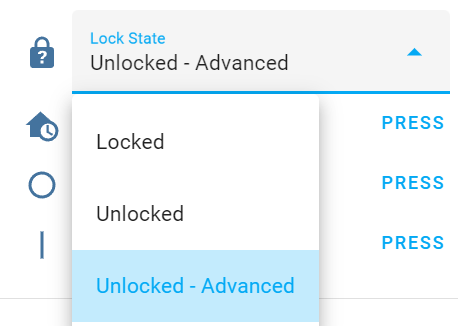
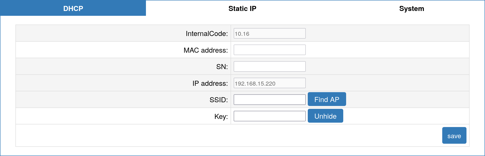

# SolaX FAQ

## How to find firmware version?

SolaX products (TODO - find out which, maybe only gen4?) provide a "firmware version", however it's stuck at the initial release version number. You need to get internal code. 

* SolaX Gen3 Hybrid - "Firmware Version DSP" & "Firmware Version ARM" (Disabled by default)
* SolaX X3 Hybrid G4 - `27 07 26` means firmware versions DSP V1.27 and ARM V1.26
* SolaX Pocket WiFi 3.0 - internal code `10.16` means firmware version V3.010.16

## Unable to change values (read only)

If you can read values, but unable to adjust select / number you need to change the select "Lock State" from "Locked" to "Unlocked". Might need performing again following a full Power Cycle.

## How to connect PocketWiFi 3.0 to my Wi-Fi network?

You can use the SolaX cloud app or do it manually:

- Connect to the hotspot your dongle transmits TODO example.
- Navigate to <http://5.8.8.8/> or <http://192.168.10.10/> (test both, depends on firmware of the dongle, may change after an update). Username is `admin` and default password your dongle SN (it's in the SSID and printed on the label)
- You can use static IP or DHCP, static IP is recommended, as the IP won't change after your router reboot. Common mistake is that static IP is set in DHCP address range, don't do that! Refer to your router which IPs you can use. Fill in the details and submit.

- Your device will connect to your Wi-Fi network, the device will remain reachable over its Wi-Fi hotspot and you can also connect by the IP you have set in your network.

## I have lost my entities on restart / update using PocketWiFi 3.0

Pocket WiFi 3.0 with Firmware V3.004.03 and above is only officially supported.
- **Ensure Firmware is uptodate (Contact SolaX)**
- Restart your rooter and then reload the integration in Home Assistant.
- If that doesn't work you can unplug PocketWifi 3.0 for 30 seconds and plug it in again, then reload the integration.

## I have multiple inverters in master-slave mode and I can't connect to them via Modbus

There are no active developers with this setup, so we have limited ability to resolve this issue, but here are common problems to check:

- Ensure all inverters have a different modbus address
- Try setting longer polling frequency (double or more)
- Check baudrate is the same on all inverters