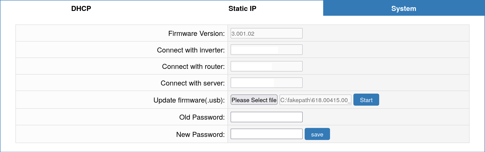

# SolaX firmware update

Note: while this should be a safe procedure, you are doing this at your own risk and responsibility. We won't/can't help you any in case of any issues. This manual is for SolaX G4, other generations might be different.

It is recommended to have the latest firmware installed on your inverter, it may fix isssues, increase stability, update reginal regulations and add new features. Unfortunately SolaX has no way of automatic updates and the update can be done in two ways:

- Contact SolaX support - they are able to update your inverter remotely, you have to wait, but you are less likely to break anything.
- Manual update from USB stick - you can update your inverter manually with firmware version of your choice.
    - Latest SolaX firmwares can be found in [this repository](https://app.box.com/s/3nvo7ic523fhojf8uuto105q9a8dgk9n/folder/79352264617) **This link isn't affiliated with homeassistant-solax-modbus nor has the authenticity of it been checked.**
## Inverter
### Prepare for update
  - Obtain the latest firmware for your inverter.
  - Reseller states following conditions for G4 **must** be met:
    - **PV array voltage above 180 V**
    - **Battery SOC above 20 %**
  - Your USB stick must
    - be from a reliable brand
    - have total capacity lower than 32 GB 
    - be freshly formatted FAT16 or FAT32
  - Create a directory in the root of the stick named `update`
  - Create subdirectories in directory `update` named `ARM` and `DSP`.
  - Put the firmware files in corresponding subdirectories, do not change their name or contents.

### Update

- Press `ENTER` key for 5 seconds to turn your inverter down.
- Remove your dongle from the USB port (PocketWifi, Pocket4G, Pocketeth)
- Plug in your USB stick
- Enter update menu
- **Update ARM firmware first**. After the ARM firmware is updated, wait one minute.
- Update the DSP firmware
- Remove the USB stick and start your inverter.

## PocketWifi 3.0

- Use your browser and visit [web interface of the dongle](solax-faq.md#how-to-connect-pocketwifi-30-to-my-wi-fi-network).
- Navigate at `System` tab. Select your firmware file in the `Update firmware` field and then click `Start`.

- Verify `InternalCode` matches the firmware you selected, if so, update is done.