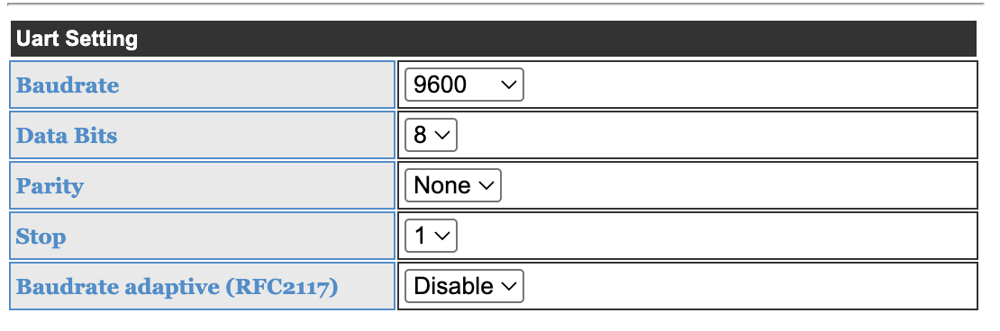
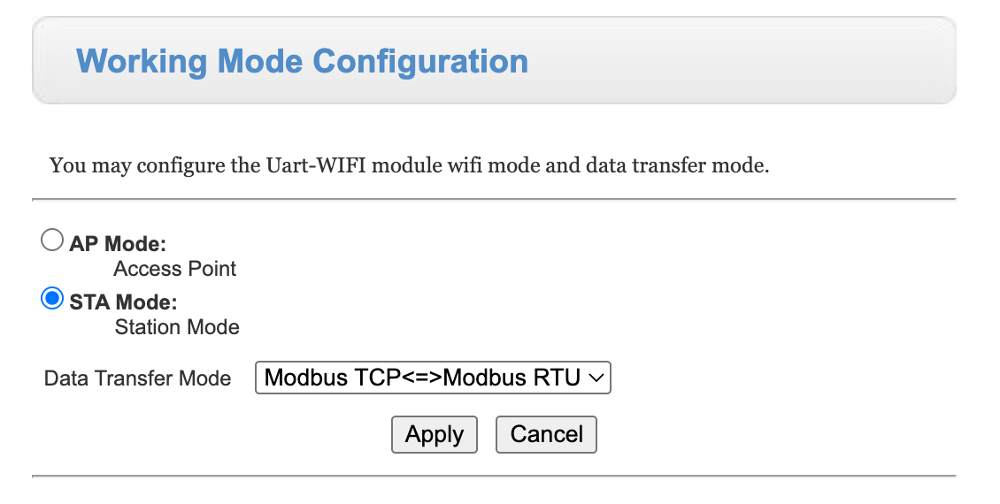
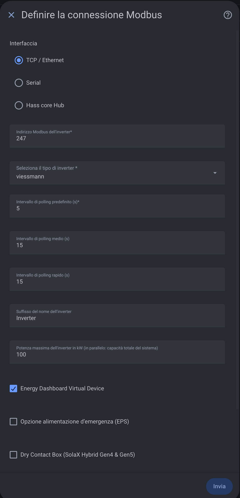

# Viessmann / GoodWe installation

This contribution adds support for Viessmann Hybrid Inverter B1 devices to
[@wills106's SolaX Modbus Home Assistant custom component](https://github.com/wills106/homeassistant-solax-modbus).
The Viessmann inverter uses a GoodWe-compatible Modbus register map.

The implementation has been validated with a Viessmann HINV6.0-B1. Other
Viessmann or GoodWe-derived models may use the same register map, but should be
verified before being considered supported.

## Requirements

- A supported Viessmann inverter with its RS485 interface available.
- A Waveshare RS485-to-Ethernet or RS485-to-Wi-Fi gateway that supports
  Modbus TCP to Modbus RTU conversion.
- Home Assistant with HACS installed.
- The SolaX Modbus custom component containing `plugin_viessmann`.

Assign the Waveshare gateway a stable IP address, either statically or through
a DHCP reservation. Home Assistant must be able to reach this address on TCP
port `502`.

## RS485 wiring

Disconnect power before working on the inverter communication terminals and
follow the inverter and gateway manuals.

Connect the inverter RS485 terminals to the Waveshare gateway:

| Inverter | Waveshare |
| --- | --- |
| RS485 A / D+ | A / D+ |
| RS485 B / D- | B / D- |
| GND, when required by the installation | GND |

If communication does not work, verify the A/B polarity before changing any
software setting. Use termination resistors as required by the cable length,
gateway and inverter documentation.

## Configure the Waveshare gateway

Open the Waveshare web interface and configure the UART with these values:

- Baud rate: `9600`
- Data bits: `8`
- Parity: `None`
- Stop bits: `1`
- Baud rate adaptive / RFC2217: `Disable`

Select station mode when the gateway must join an existing Wi-Fi network. Set
the data transfer mode to `Modbus TCP <=> Modbus RTU`, apply the settings and
restart the gateway if requested.

Do not use transparent mode for this setup. The gateway must translate standard
Modbus TCP requests from Home Assistant into Modbus RTU requests for the
inverter.

## Install the custom component

Install SolaX Modbus through HACS using the normal
[integration installation instructions](installation.md). Restart Home
Assistant after installing or updating the custom component.

The `viessmann` plugin must appear in the inverter type list. If it does not,
confirm that `custom_components/solax_modbus/plugin_viessmann.py` is installed
and restart Home Assistant.

## Configure Home Assistant

Add the SolaX Modbus integration and select:

- Interface: `TCP / Ethernet`
- Host: the IP address of the Waveshare gateway
- Port: `502`
- Modbus TCP variant: standard TCP
- Inverter Modbus address: `247`
- Inverter type: `viessmann`
- Default polling interval: `5` seconds or slower
- Medium polling interval: `15` seconds
- Fast polling interval: `15` seconds

The inverter defaults to Modbus address `247`. Use another value only if it has
been explicitly changed in the inverter configuration.

The Energy Dashboard virtual device can be enabled. EPS and SolaX-specific dry
contact options are not required for the Viessmann plugin.

## Verify the connection

After submitting the configuration, verify that the integration creates the
Viessmann inverter device and that values such as PV power, grid power, battery
state of charge and meter communication status are available.

The grid import and export energy totals are read from the physical meter
registers. Daily grid import and export are calculated from those cumulative
meter values and reset at local midnight.

If all entities remain unavailable:

1. Confirm that Home Assistant can reach the Waveshare IP address and TCP port
   `502`.
2. Confirm `9600 / 8 data bits / no parity / 1 stop bit`.
3. Confirm `Modbus TCP <=> Modbus RTU` mode.
4. Confirm Modbus address `247`.
5. Check RS485 A/B polarity and meter communication status.
